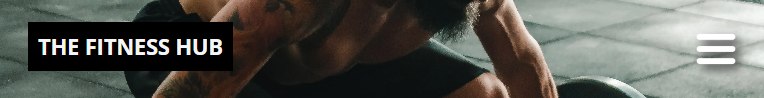
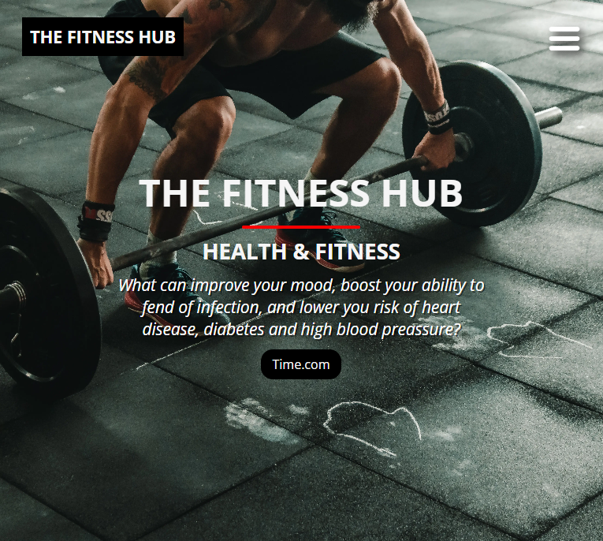
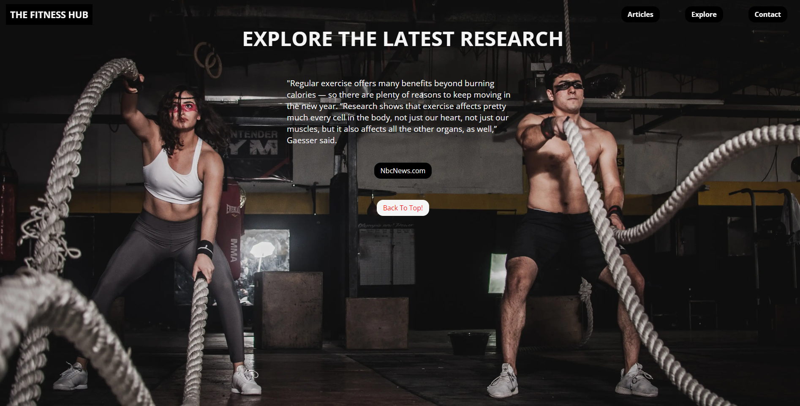
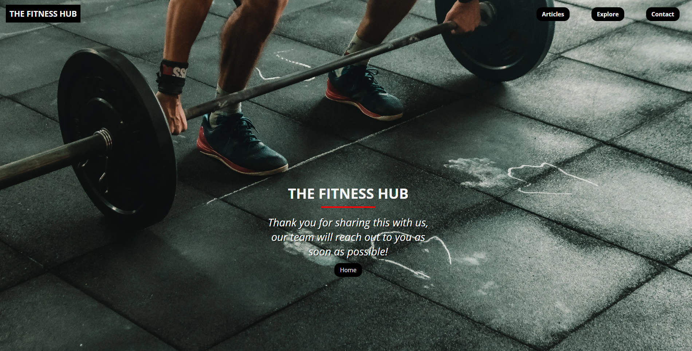
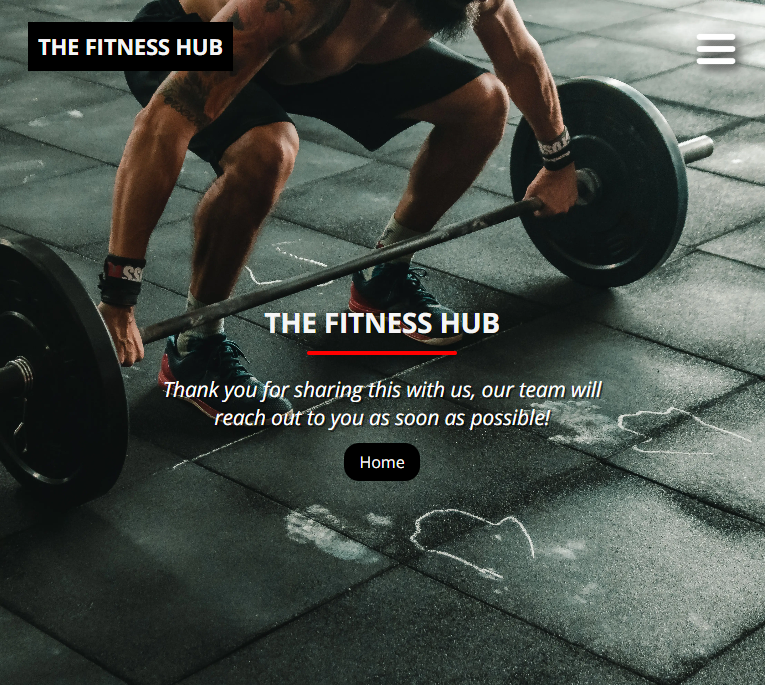

<h1 align="center">The Fitness Hub</h1>

The Fitness Hub is made for the health & fitness enthusiast!

## Live Site
[TheFitnessHub](https://madebybrown.github.io/FitnessHub.com/)

## Links
- [Repository](https://github.com/Madebybrown/FitnessHub.com)
- [Linkedin](https://www.linkedin.com/in/alexander-jonsson-312a70248/)

## Table Of Contents
- [Discription](#discription)
- [Key Goals](#key-goals)
- [Target Audience](#target-audience)
- [Built With](#built-with)
- [Screenshots](#screenshots)
- [Features](#features)
    - [Home / Navigation Bar](#home--navigation-bar)
    - [Featured Articles](#featured-articles)
    - [Explore](#explore)
    - [Thank You](#thank-you-page)
- [Links](#)
- [Credit Section](#credit-section)

 

## Discription

The Fitness Hub is a health & fitness focused site where you will be able to find the latest research articles regarding health & fitness, in the future you will have the possibility to create your own login account and get access to more useful features, one being able to save articles to be read later or to be shared with your friends.

The Fitness Hub is built using HTML & CSS and I did run into alot of obstacles while building it, one of them being the positioning and the size of contents on different screen sizes, and also the contact form overlapping the drop down menu. Images will be found further down.

 

## Key Goals
- To showcase my eye for front end design and my competency as a developer using HTML & CSS.
- To problem solve and tackle challenges that forces me to learn more.

### External Goals
- To create a website that solves the questions regarding where to find up to date information regarding research on health & fitness.

 

## Target Audience

Health & Fitness enthusiasts, personal trainers.

 

## Screenshots

## Features

The website contains common features, a navbar at the top of the page that sticks to the top while scrolling down and collapses into a hamburger menu when used on smaller screens, it's intended purpose is to be straight forward and easy to use among all the sections and pages.

## Home / Navigation bar

 

 

 

 

 

## Featured Articles

The featured articles section is where the newest articles are displayed, the user can reach this section by scrolling down or use the navigation menu.

The purpose of this section is to showcase the latest articles by giving a snippet of what the article is about and then prompt the reader to read more about the subject.

 

 

 

 

## Explore

The purpose of the explore section is to display one single article, mostly regarding general health advice that are easy to implement for most people. The sections also includes a "Back to top" link for an easy return to the top.

 

 

 

 

## Contact

The contact page is where the visitor have the ability to send us their thoughts regarding anything on the site. There are requirements to enter a name and an email address, and the option to include their phone number if they feel the need to be contacted via a phone message.

 

 

 

 

## Thank You Page

A page to show gratitude to the visitor for sharing their thoughts with us.

 

 

 

 

## Thank You Page

Footer with my perosnal social links to github repo and linkedin.

 

 

 

## Technologies Used
- [HTML5](https://sv.wikipedia.org/wiki/HTML5) - Provides structure and content to site
- [CSS](https://en.wikipedia.org/wiki/CSS) - To give html style rules
- [Github](https://github.com/) - Used to start project and deploy
- [Gitpod](https://www.gitpod.io/) - Used to host and create the site
- [Google Fonts](https://fonts.google.com/about) - Import fonts to the site
- [Over / Godaddy Studio](https://studio.godaddy.com/login) - Used to manilpulate images
- [Chrome Dev Tools](https://developer.chrome.com/docs/devtools/) - Used throughout the whole project to overview the responsiveness and make style changes to implement
- [Am I Responsive](https://ui.dev/amiresponsive) - Used to create mockup images of site on different devices
- [Color Mind](http://colormind.io/) - Used to find colors that match together

 

## Testing

The Fitness Hub has been tested in this different ways:

- Code Validation
    - W3C HTML Validator
 
Index.html

Contact.html

Thankyou.html

- Code Validation
    - W3C HTML Validator
 
Style.html

## Lighthouse
- Lighthouse was used to test the sites: 
    - Performance - How the page performs during loading.
    - Accessibility - How accessible is the site and how can it be improved.
    - Best Practices - How does the site live up to industry best practices.
    - SEO - Search engine optimisation.

## Credit Section
- [**Contact Form**](https://youtu.be/f0DcnrpeBv8)
- [**Flex direction**](https://www.youtube.com/watch?v=ujXa2wQnAuU)
- [**Flexbox**](https://www.youtube.com/watch?v=u044iM9xsWU)
- [**Smooth scroll effect**](https://www.w3schools.com/howto/howto_css_smooth_scroll.asp)
- [**Css units**](https://www.youtube.com/watch?v=N5wpD9Ov_To)
- [**Navbar**](https://www.youtube.com/watch?v=PwWHL3RyQgk)
- [**css selector reference**](https://www.w3schools.com/cssref/css_selectors)

## [Back To The Top](#live-site)