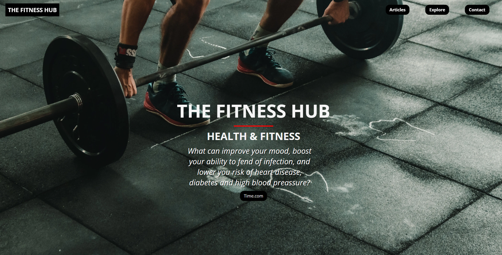
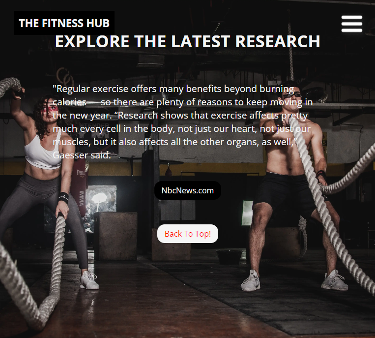
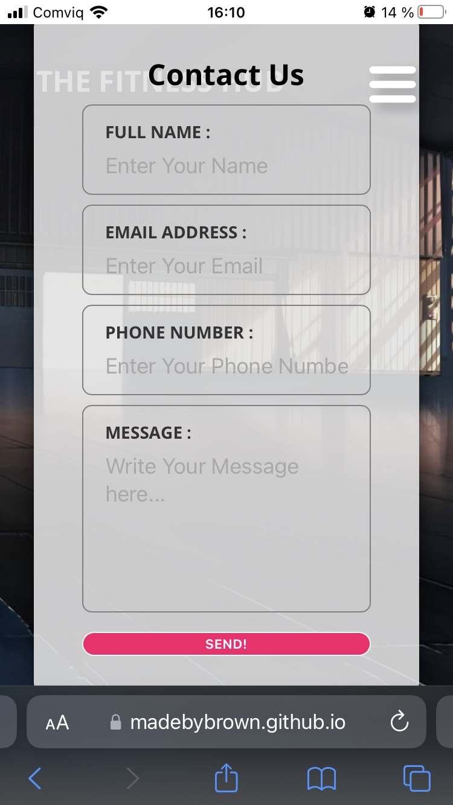
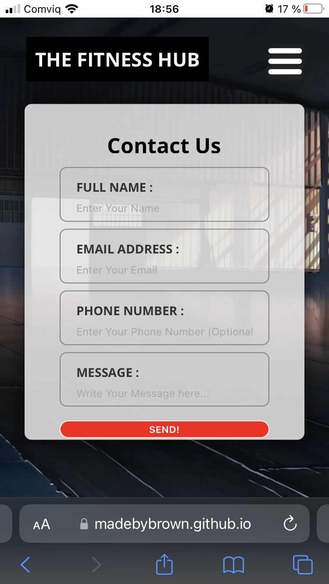

<h1 align="center">The Fitness Hub</h1>

The Fitness Hub, a place for the health & fitness enthusiast!

## Table Of Contents
- [Description](#description)
- [Live Site](#live-site)
- [Goals](#key-goals)
- [Target Audience](#target-audience)
- [Social Links](#Social-links)
- [Screenshots](#screenshots)
- [Features](#features)
    - [Home / Navigation Bar](#home--navigation-bar)
    - [Featured Articles](#featured-articles)
    - [Explore](#explore)
    - [Contact](#contact)
    - [Thank You Page](#thank-you-page)
    - [Footer](#footer)
    - [Future Features](#future-features)
- [Deployment](#deployment)
- [Technologies Used](#technologies-used)
- [Testing](#testing)
    - [Code Validation](#validation)
    - [Lighthouse](#lighthouse)
    - [Responsiveness](#responsiveness)
    - [Bugs](#bugs)
- [Credit Section](#credit-section)

 

## Description

The Fitness Hub is a website that aims to provide its visitors with relevant articles regarding health & fitness.

If you're as passionate about health & fitness as we are, then The Fitness Hub is the perfect website for you!

 

## Live Site
[TheFitnessHub](https://madebybrown.github.io/TheFitnessHub.com/)

 

## Key Goals
- To showcase my competency as a developer using HTML & CSS.
- To problem solve and tackle challenges that force me to learn more about good coding practices.

### External Goals
- To create a website that solves the questions regarding where to find information regarding research on health & fitness.

 

## Target Audience

Health & Fitness enthusiasts, personal trainers.

 

## Social Links
- [Repository](https://github.com/Madebybrown/TheFitnessHub.com.git)
- [Linkedin](https://www.linkedin.com/in/alexander-jonsson-312a70248/)

 

## Features

The website contains common features, a navbar at the top of the page that sticks to the top while scrolling down and collapses into a hamburger menu when used on smaller screens, its intended purpose is to be easy to use among all the sections and pages.

## Home / Navigation bar

Navigation bar on the desktop, website logo to the left, and navigation links to the right.

 

Navigation bar on mobile, website logo to the left, and hamburger menu to the right.

 

Home section on desktop with Ethos / Article link in the middle.

 

Home section on mobile with Ethos / Article link in the middle.

 

Home section on mobile, with drop down menu

 

## Featured Articles

The featured articles section is where the newest articles are displayed, the user can reach this section by scrolling down or using the navigation menu.

The purpose of this section is to showcase the latest articles by giving a snippet of what the article is about and then prompt the reader to read more about the subject.

 

Featured article section on desktop

 

Featured article section on mobile

 

Featured article section on mobile with drop down menu

 

## Explore

The purpose of the explore section is to display one single article, mostly regarding general health advice that is easy to implement for most people. The sections also include a "Back to top" link for an easy return to the top.

 

Explore section on desktop

 

Explore section on mobile

 

Explore section on mobile with drop down menu

 

## Contact

The contact page is where the visitor can send us their thoughts regarding anything on the site. There are requirements to enter a name and an email address, and the option to include their phone number if they feel the need to be contacted via a phone message.

 

Contact page on desktop

 

Contact page on mobile

 

Contact page on mobile with drop down menu

 

## Thank You Page

A page to show gratitude to the visitor for sharing their thoughts with us.

 

Thank you page on desktop

 

Thank you page on mobile

 

Thank you page on mobile with drop-down menu

 

## Footer

Footer with my social links to GitHub repo and LinkedIn.

 

Footer on desktop

 

Footer on mobile

 

## Future Features
- Landing page - A single landing page with an ethos and log-in.
- Account creation - Enables the visitor to save and store interesting articles that they may want to read later or share with their friends and family.
- Share function - Makes it easier to share articles across other platforms.
- Article Gallery - A collection of all the articles posted on the website, grouped into categories and sections.
- Hamburger menu - drop-down menu to the side instead of in the top middle.
- Featured articles - Increase the number of articles in the featured articles section.

## Deployment
- The website was deployed using GitHub
1. Enter repositories

2. Locate FitnessHub.com and click it

3. Go to settings

4. On the left-hand side is a section called Pages, click it

5. Select the Branch to be "Main" and click save

6. Now wait a few minutes for GitHub to build and deploy your site then refresh the page and at the top of the Pages section you will find the link to your deployed website.

## Technologies Used
- [HTML5](https://sv.wikipedia.org/wiki/HTML5) - Provides structure and content to site
- [CSS](https://en.wikipedia.org/wiki/CSS) - To give HTML style rules
- [Github](https://github.com/) - Used to start the project and deploy
- [Gitpod](https://www.gitpod.io/) - Used to host and create the site
- [Google Fonts](https://fonts.google.com/about) - Import fonts to the site
- [Over / Godaddy Studio](https://studio.godaddy.com/login) - Used to manipulate images
- [Chrome Dev Tools](https://developer.chrome.com/docs/devtools/) - Used throughout the whole project to overview the responsiveness and make style changes to implement
- [Am I Responsive](https://ui.dev/amiresponsive) - Used to create mockup images of site on different devices
- [Color Mind](http://colormind.io/) - Used to find colors that match together

 

## Testing

The Fitness Hub has been tested in these different ways:

### Validation

- Code Validation
    - W3C HTML Validator
 

#### Index

#### Contact

#### Thankyou

- Code Validation
    - W3C HTML Validator
 

Style.html

## Lighthouse
- Lighthouse was used to test the sites: 
    - Performance - How the page performs during loading.
    - Accessibility - How accessible is the site and how can it be improved?
    - Best Practices - How does the site live up to industry best practices?
    - SEO - Search engine optimization.
 

After a few tests and changes I managed to increase the score by changing image formats and adding a meta description to the head.

 

## First test

## Second test

## Third test

## Fourth test

## Fifth test

## Responsiveness
- I tested the responsive design with [Chrome Dev Tools](https://developer.chrome.com/docs/devtools/)
    - Ipad air & mini
    - iPhone SE, XR, and 12Pro
    - Pixel 5
    - Samsung Galaxy S8, S20 Ultra, A51/71
    - Surface Pro 7 & duo
    - Galaxy Fold
    - Nest Hub & Hub Max

    
I also tested the website on iPhone 7, iPhone 8, and a Lenovo legion 5, the only issue I've encountered is that on the iPhone 7 and 8 one element didn't stay consistent with its original design, check out the link below for pictures.

    [Unresolved](#unresolved)

## Browsers
- The site was tested on Google Chrome, Microsoft Edge, and Safari. There were no issues with any of the browsers and the design looked consistent on all the browsers.

## Bugs
### Problem

The contact form is out of alignment

### Resolved

By removing the footer

### Problem

The contact form stretches to far outside of the viewport height.

### Resolved

By adding specific style rules to a media query this issue was resolved.

### Problem

The issue here is the section stretches too far down and outside of the image, the aim is to have the Back-to-the-top link inside of the explore section image.

### Resolved

By adding a font-size value of (4.2vmin) to the paragraph in media queries I managed to fit the whole section inside the image

 

## Unresolved
### Problem

This problem is only visible on a mobile phone, the Send! the button doesn't stay consistent and true to the original design, I have a hard time trying to figure out how to fix it because I can't create the same effect in Chrome Developer Tools, even though I use the same width and height as an iPhone 7.

### Problem

Issue with the keyboard on android.

## Credit Section
- [**Contact Form**](https://youtu.be/f0DcnrpeBv8)
    - The template for the contact form.
- [**Flex direction**](https://www.youtube.com/watch?v=ujXa2wQnAuU)
    - How to place elements with flex-direction.
- [**Flexbox**](https://www.youtube.com/watch?v=u044iM9xsWU)
    - How to use flexbox to build the structure of the website.
- [**Smooth scroll effect**](https://www.w3schools.com/howto/howto_css_smooth_scroll.asp)
    - How to create a smooth scroll effect for the menu bar auto slide to section.
- [**CSS units**](https://www.youtube.com/watch?v=N5wpD9Ov_To)
    - What unit to use when, where, and why?
- [**Navbar**](https://www.youtube.com/watch?v=PwWHL3RyQgk)
    - Understanding the navbar.
- [**CSS selector reference**](https://www.w3schools.com/cssref/css_selectors.asp)
    - List of CSS selectors.
- [**Pexels.com**](https://www.pexels.com/)
    - pictures were taken from Pexels.com

## [Back To The Top](#table-of-contents)